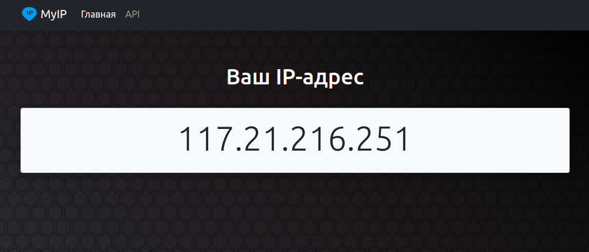

# MyIP

MyIP — это веб-сервис, помогающий пользователю узнать его собственный публичный IP-адрес. Для роботов сервис предоставляет простой JSON API.



Сервис написан с использованием двух фреймворков Flask и Django. Первый отвечает за стартовую страницу, а второй — за API. Используются сразу два фреймворка, чтобы показать затем, как совместить несколько разнородных бэкендов за одним веб-сервером Nginx.

## Запуск

Для запуска сайта у вас уже должен быть установлен Python 3.

Скачайте код из этого репозитория:

```
git clone git@github.com:devmanorg/myip-multi-framework.git
```

Создайте новое виртуальное окружение и установите зависимости:

```
pip install -r requirements.txt
```

Отройте два терминала. В одном из них запустите Flask:

```
cd flask_project
FLASK_DEBUG=1 flask run
```

Во втором терминале запустите Django:

```
cd django_project
./manage.py migrate
./manage.py runserver
```

После этого отройте в браузере две ссылки:

- Сайт с Flask по адресу [127.0.0.1:5000](http://127.0.0.1:5000/)
- Сайт с Django по адресу [127.0.0.1:8000/api/ip/](http://127.0.0.1:8000/api/ip/)

## Переменные окружения

Часть настроек проекта берётся из переменных окружения. Чтобы их определить, создайте файл `.env` рядом с `manage.py` и запишите туда данные в таком формате: `ПЕРЕМЕННАЯ=значение`.

**Для запуска проекта эти настройки не требуются**, значения уже проставлены по умолчанию.

Доступны следущие переменные:

- `DJ_DEBUG` — переключает дебаг-режим для Django, значения `TRUE` и `FALSE`.
- `DJ_SECRET_KEY` — секретный ключ проекта для Django, [документация Django](https://docs.djangoproject.com/en/3.1/ref/settings/#std:setting-SECRET_KEY).
- `ALLOWED_HOSTS` — список хостов через запятую, см [документацию Django](https://docs.djangoproject.com/en/3.1/ref/settings/#allowed-hosts).

## Цели проекта

Код написан для туториала из курса по Python и веб-разработке [Devman](https://dvmn.org).

Ссылка на туториал: [Настройка Django и Flask c Nginx и Gunicorn в Ubuntu](https://devman.org/encyclopedia/web-server/deploy-django-nginx-gunicorn/)
